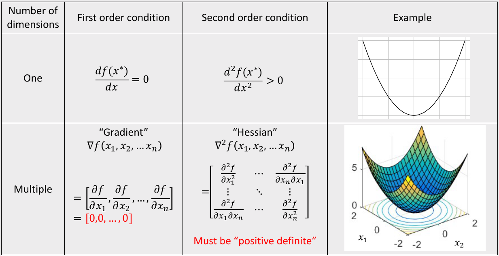
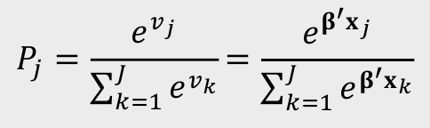
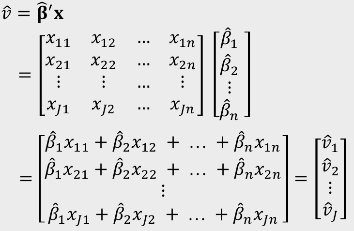

```{r setup, include=FALSE}
library(knitr)
library(tidyverse)
library(fontawesome)
library(kableExtra)
library(countdown)
library(metathis)
library(here)

options(
  htmltools.dir.version = FALSE,
  knitr.table.format = "html",
  knitr.kable.NA = '',
  dplyr.width = Inf,
  width = 250
)

knitr::opts_chunk$set(
  cache = FALSE,
  warning = FALSE,
  message = FALSE,
  fig.path = "figs/",
  fig.width = 7.252,
  fig.height = 4,
  comment = "#>",
  fig.retina = 3
)

# Setup xaringanExtra options
xaringanExtra::use_xaringan_extra(c(
  "tile_view", "panelset", "share_again", "clipboard"))
xaringanExtra::style_share_again(share_buttons = "none")
xaringanExtra::use_extra_styles(
  hover_code_line = TRUE,
  mute_unhighlighted_code = FALSE
)

# Set up website metadata
meta() %>%
  meta_general(
    description = rmarkdown::metadata$subtitle,
    generator = "xaringan and remark.js"
  ) %>%
  meta_name("github-repo" = "emse-madd-gwu/2022-Fall") %>%
  meta_social(
    title = rmarkdown::metadata$title,
    url = "https://madd.seas.gwu.edu/2022-Fall/",
    og_type = "website",
    og_author = "John Paul Helveston",
    twitter_card_type = "summary_large_image",
    twitter_creator = "@johnhelveston"
  )
```

class: middle, inverse

.leftcol30[

<center>

</center>

]

.rightcol70[

# Week `r rmarkdown::metadata$week`: .fancy[`r rmarkdown::metadata$title`]

### `r fontawesome::fa(name = "building-columns", fill = "white")` `r rmarkdown::metadata$subtitle`
### `r fontawesome::fa(name = "user", fill = "white")` `r rmarkdown::metadata$author`
### `r fontawesome::fa(name = "calendar", fill = "white")` `r rmarkdown::metadata$date`

]

---

```{r child="topics/0.Rmd"}
```

---

```{r child="topics/1.Rmd"}
```

---

class: center 

## Willingness to Pay (WTP)

<br>

## $$\tilde{u}_j = \alpha p_j + \boldsymbol{\beta} x_j + \tilde{\varepsilon_j}$$

<br>

--

## $$\boldsymbol{\omega} = \frac{\boldsymbol{\beta}}{-\alpha}$$

---

class: center

# Notational convention

.leftcol[

# Model 
## $$\tilde{u}_j = \alpha p_j + \boldsymbol{\beta} x_j + \tilde{\varepsilon_j}$$
## $$\boldsymbol{\omega} = \frac{\boldsymbol{\beta}}{-\alpha}$$

]

.rightcol[

# Estimated Model
## $$\tilde{u}_j = \hat{\alpha} p_j + \hat{\boldsymbol{\beta}} x_j + \tilde{\varepsilon_j}$$
## $$\hat{\boldsymbol{\omega}} = \frac{\hat{\boldsymbol{\beta}}}{-\hat{\alpha}}$$

]

---

class: inverse

# Practice Question 1

.leftcol[

Suppose we estimate the following utility model describing preferences for cars:

$$
\tilde{u}_j = \alpha p_j + \beta_1 x_j^{\mathrm{mpg}} + \beta_2 x_j^{\mathrm{elec}} + \varepsilon_j
$$

The estimated model produces the following coefficients:

- $\alpha$: -0.7
- $\beta_1$: 0.1
- $\beta_2$: -4.0

]

.rightcol[

a) Use the estimated coefficients to compute the WTP for fuel economy and electric car vehicle type.

]

---

```{r child="topics/2.Rmd"}
```

---

# .center[Simulating uncertainty]

We can use the coefficients and hessian from a model to obtain draws that reflect parameter uncertainty

.leftcol[

```{r}
beta <- c(-0.7, 0.1, -4.0)

hessian <- matrix(c(
    -6000,   50,   60,
       50, -700,   50,
       60,   50, -300),
    ncol = 3, byrow = TRUE)
```

]

.rightcol[

```{r}
covariance <- -1*solve(hessian)
draws <- MASS::mvrnorm(10^4, beta, covariance)

head(draws)
```

]

---

# .center[Computing WTP with draws]

## $$\hat{\boldsymbol{\omega}} = \frac{\hat{\boldsymbol{\beta}}}{-\hat{\alpha}}$$

--

.leftcol55[

```{r}
draws_other <- draws[,2:ncol(draws)]
draws_price <- draws[,1]
draws_wtp <- draws_other / (-1*draws_price)
head(draws_wtp)
```

]

--

.rightcol45[

Mean WTP with confidence interal
```{r}
maddTools::ci(draws_wtp)
```

]

---

class: inverse

## Practice Question 2

Suppose we estimate the following utility model describing preferences for cars:

$$
\tilde{u}_j = \alpha p_j + \beta_1 x_j^{\mathrm{mpg}} + \beta_2 x_j^{\mathrm{elec}} + \varepsilon_j
$$

.leftcol[

The estimated model produces the following coefficients and hessian:

- $\alpha$: -0.7
- $\beta_1$: 0.1
- $\beta_2$: -4.0

$$
\nabla_{\beta}^2 \ln(\mathcal{L}) =
\begin{bmatrix}
-6000 & 50 & 60
\\
50 & -700 & 50
\\
60 & 50 & -300
\end{bmatrix}
$$

]

.rightcol[

a) Generate 10,000 draws of the model coefficients using the estimated coefficients and hessian. Use the `mvrnorm()` function from the `MASS` library.

b) Use the draws to compute the mean WTP and 95% confidence intervals of WTP for fuel economy and electric car vehicle type.

]

---

# .center[Computing WTP from an estimated model]

<br>

.rightcol80[

## 1. Open `logitr-cars`

## 2. Open `code/6.1-compute-wtp.R`

]

---

class: inverse

```{r, echo=FALSE}
countdown(
  minutes = 10,
  warn_when = 15,
  update_every = 1,
  top = 0,
  right = 0,
  font_size = '2em'
)
```

## Your Turn

.leftcol80[.font120[

As a team, compute the WTP from an estimated model you used in your pilot analysis report

]]

---

```{r child="topics/3.Rmd"}
```

---

class: center 

## Willingness to Pay (WTP)

.leftcol[

## "Preference Space"

## $$\tilde{u}_j = \alpha p_j + \boldsymbol{\beta} x_j + \tilde{\varepsilon_j}$$

]

--

.rightcol[

## "WTP Space"

## $$\boldsymbol{\omega} = \frac{\boldsymbol{\beta}}{-\alpha}$$
## $$\lambda = - \alpha$$
## $$\tilde{u}_j = \lambda (\boldsymbol{\omega} x_j - p_j) + \tilde{\varepsilon_j}$$

]

---

background-color: #EEEDEE
class: center 

# WTP space models have **non-convex**<br>log-likelihood functions!

<center>

</center>

---

class: center 

# WTP space models have non-convex<br>log-likelihood functions!

<br>

# **Use multi-start loop with<br>random starting points**

---

# .center[Computing WTP from an estimated model]

<br>

.rightcol80[

## 1. Open `logitr-cars`

## 2. Open `code/6.2-model-wtp.R`

]

---

class: inverse

```{r, echo=FALSE}
countdown(
  minutes = 10,
  warn_when = 15,
  update_every = 1,
  top = 0,
  right = 0,
  font_size = '2em'
)
```

## Your Turn

.leftcol80[.font120[

As a team, re-estimate the main model you used in your pilot analysis report, but now in the WTP space.

Try plotting your results (see `6.3-plot-wtp.R` for examples)

]]

---

class: inverse, center

# .fancy[Break]

```{r, echo=FALSE}

countdown(
    minutes      = 5,
    warn_when    = 30,
    update_every = 1,
    left         = 0, right = 0, top = 1, bottom = 0,
    margin       = "5%",
    font_size    = "8em"
)
```

---

```{r child="topics/4.Rmd"}
```

---

background-color: #EEEDEE
class: center

## We want to find $\boldsymbol{\beta}$ by maximizing the log-likelihood

<center>


</center>

---

# .center[Simulate Market Shares]

## 1. Define a market, $X$

## 2. Compute shares:

## $$\hat{P}_j = \frac{e^{\hat{\boldsymbol{\beta}}'\boldsymbol{X}_j}}{\sum_{k=1}^J e^{\hat{\boldsymbol{\beta}}'\boldsymbol{X}_k}}$$

---

background-color: #EEEDEE

# .center[Simulate Market Shares]

<center>

</center>

---

background-color: #EEEDEE

# .center[Simulate Market Shares]

.leftcol70[

<center>

</center>

]

.rightcol30[

In R:
```{r, eval=FALSE}
X %*% beta
```

]

---

class: inverse

# Practice Question 1

.leftcol[

Suppose we estimate the following utility model describing preferences for cars:

$$
\tilde{u}_j = \alpha p_j + \beta_1 x_j^{\mathrm{mpg}} + \beta_2 x_j^{\mathrm{elec}} + \varepsilon_j
$$

The estimated model produces the following coefficients:

- $\alpha$: -0.7
- $\beta_1$: 0.1
- $\beta_2$: -4.0

]

.rightcol[

a) Use the estimated coefficients to compute the WTP for fuel economy and electric car vehicle type.

b) Use the estimated coefficients to compute market shares for the alternatives in the following market:


alternative | price | mpg | elec
------------|-------|-----|--------
1 | 15 | 20 | 0
2 | 30 | 100 | 1
3 | 20 | 40 | 0

]

---

# .center[Simulating Market Shares with Uncertainty]

We can use the coefficients and hessian from a model to obtain draws that reflect parameter uncertainty

.leftcol[

```{r}
beta <- c(-0.7, 0.1, -4.0)

hessian <- matrix(c(
    -6000,   50,   60,
       50, -700,   50,
       60,   50, -300),
    ncol = 3, byrow = TRUE)
```

]

.rightcol[

```{r}
covariance <- -1*solve(hessian)
draws <- MASS::mvrnorm(10^4, beta, covariance)

head(draws)
```

]

---

# .center[Simulating Market Shares with Uncertainty]

Rely on the `predict()` function to compute shares with uncertainty. 

Internally, it:

1. Takes draws of $\boldsymbol{\beta}$
2. Computes $P_j$ for each draw 
3. Returns mean and confidence interval computed from draws

---

# .center[Simulating Market Shares with Uncertainty]

<br>

.rightcol80[

## 1. Open `logitr-cars`

## 2. Open `code/7.1-compute-market-sims.R`

]

---

class: inverse

```{r, echo=FALSE}
countdown(
  minutes = 20,
  warn_when = 15,
  update_every = 1,
  top = 0,
  right = 0,
  font_size = '2em'
)
```

## Your Turn

## As a team: 

1. Develop one or two scenarios pitting your product against one or more competitors. 
2. Use one of your estimated models and the `predict()` function to predict market shares for those scenarios. 
3. Try plotting your results (see `7.2-plot-market-sims.R` for examples)
